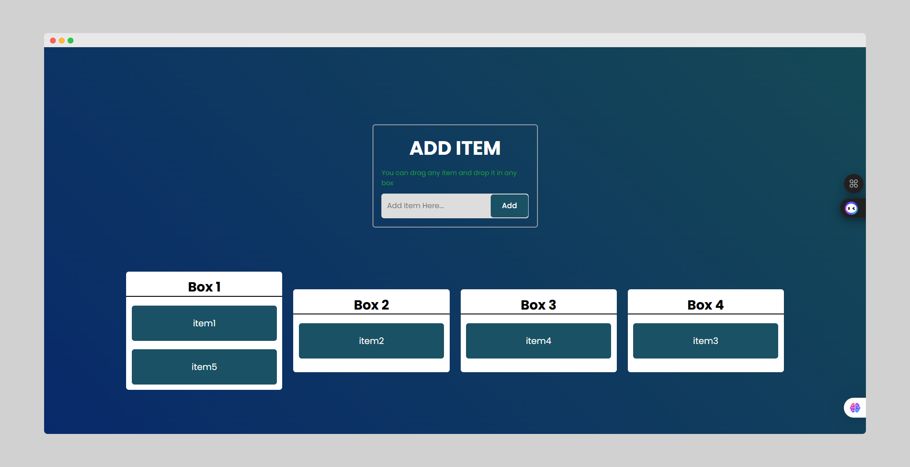

# Drag & Drop - A Simple & Interactive List App

This project is a clean and simple web application that allows users to dynamically add items to a list and organize them across multiple containers using a smooth drag-and-drop interface. It's a great example of how to handle DOM events, manage state, and build interactive UIs with vanilla JavaScript.

This project was built to practice and demonstrate key JavaScript concepts, especially event handling and DOM manipulation, with a focus on performance and clean code.

---

## ✨ Features

- **Add Items Dynamically**: Users can add new items to the first container via a simple input form.
- **Interactive Drag & Drop**: Any item can be dragged from one container and dropped into another.
- **Smooth Visual Feedback**: The UI provides clear visual cues for the item being dragged and the potential drop targets.
- **Responsive Design**: The layout adapts gracefully to different screen sizes, from desktop to mobile.
- **Efficient Event Handling**: Uses the **Event Delegation** pattern for optimal performance, ensuring the app remains fast even with a large number of items.
- **Clean & Modern UI**: A simple and intuitive user interface built with modern CSS.

---

## 🚀 Live Demo

Check out the live version of the project here:

[**Live Demo Link**]([https://your-live-demo-link.com](https://dragdr0p.netlify.app/)) 

---

## 📸 Screenshots

Here’s a sneak peek of the application in action:

 
*A screenshot showing items being added and organized.*

---

## 🛠️ Tech Stack

This project was built using fundamental web technologies:

- **HTML5**: For the basic structure and content.
- **CSS3**: For styling, layout (Flexbox), and animations.
- **Vanilla JavaScript (ES6+)**: For all the logic, interactivity, and DOM manipulation.

No frameworks or external libraries were used, making this a pure "from-scratch" implementation.

---

## 🧠 Core Concepts & Logic

The heart of this application is its JavaScript logic. Here are the key concepts implemented:

### 1. DOM Manipulation
- New items are created and added to the DOM dynamically based on user input.
- Elements are moved between parent containers (`.box`) during the drop event.

### 2. The Drag and Drop API
The native HTML Drag and Drop API is used to handle the entire process. The key events are:
- `dragstart`: Fired on an element when a drag operation starts. Used to identify which item is being dragged.
- `dragend`: Fired when the drag operation finishes (whether it was successful or not). Used for cleanup.
- `dragover`: Fired continuously on a potential drop target as a dragged item passes over it. We use `event.preventDefault()` here to allow a drop.
- `dragleave`: Fired when a dragged item leaves a potential drop target.
- `drop`: Fired when an item is dropped on a valid drop target. This is where we append the item to its new container.

### 3. Event Delegation
Instead of adding an event listener to every single draggable item, this project uses **event delegation**. A single set of event listeners is attached to the parent container (`.boxes-container`). This approach has significant benefits:
- **Performance**: It drastically reduces the number of event listeners, which is crucial for applications with many interactive elements.
- **Simplicity**: It simplifies the code by centralizing event handling logic.
- **Dynamic Content**: It automatically works for new items added to the DOM without needing to attach new listeners.

---

## 🏁 How to Run Locally

To run this project on your local machine, follow these simple steps:

1.  **Clone the repository:**
    ```bash
    git clone https://github.com/n3ssar/Drag-Drop.git
    ```

2.  **Navigate to the project directory:**
    ```bash
    cd your-repo-name
    ```

3.  **Open `index.html` in your browser:**
    You can simply double-click the `index.html` file, or use a live server extension (like "Live Server" in VS Code) for a better development experience with hot-reloading.

And that's it! You can now interact with the application.

---

## 💡 Future Improvements

- **Local Storage**: Persist the items and their positions in the browser's local storage, so the user's list is saved between sessions.
- **Delete Items**: Add a "delete" button to each item to allow users to remove them.
- **Edit Items**: Implement a feature to allow users to edit the text of an existing item.
- **More Animations**: Enhance the user experience with more sophisticated animations and transitions using a library like Framer Motion or GSAP.

---

Feel free to clone, fork, and contribute to this project. Any feedback or suggestions are welcome!
